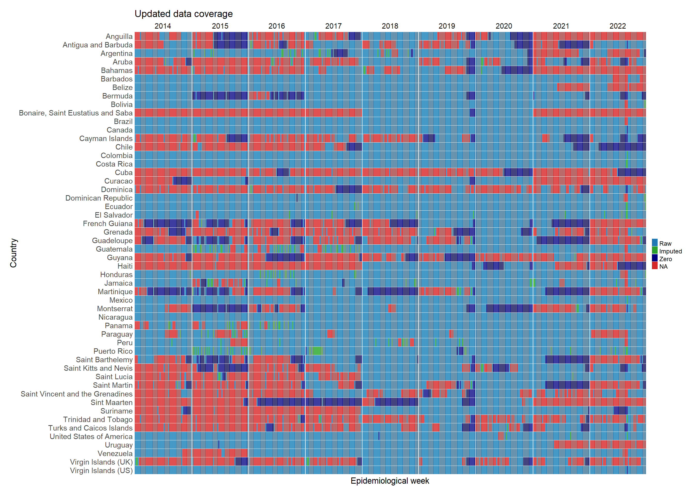

Hello, Website!


This is our heatmap.


```{r, echo=FALSE}

chik <- read.csv("data/ZIKV_oc_dmmg.csv")
library(downloadthis)
# Create a select input for the user to choose a year
selectInput("year", "Select year:", choices = unique(chik$Year))

# Subset the data frame based on the selected year
 subset_data <- reactive({
  subset(data, Year == input$Year)
})
 
 
 subset_data %>%
    download_this(
    output_name = "national dataset",
    output_extension = ".csv",
    button_label = "Download OpenDengue national data as csv",
    button_type = "info",
    has_icon = TRUE,
    icon = "fa fa-save",
    class = "button_large"
  )
```


